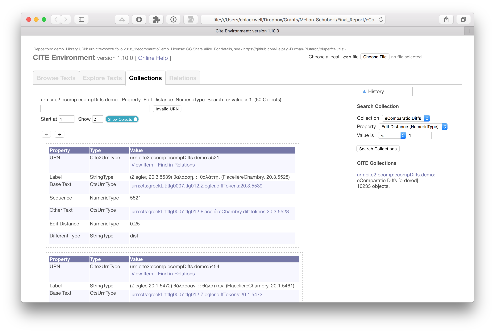

# eComparatio-CITE Demo Package

A demonstration package showing eComparatio (<https://github.com/ecomp-shONgit/ecomparatio>) data integrated with the CITE Environment.

## Contents

- CiteApp: A local copy of CiteApp, configured to load the eComparatio data for Plutarch's *Pericles* by default. 

>	Run it by double-cliking `CiteApp-1.10.0.html1. **N.b.** This digital library is very large, and CiteAppl will take a certain time to load it.

- CiteService: A Microservice delivering CITE data as JSON responses to HTTP requests.

> Run it by …. See `CiteService/README.md` for example requests.

- IntegrationBuild: The `SBT`/`Scala` build-package that uses CITE code libraries to generate a CEX serialization of two texts of Plutarch's *Pericles* and a collection of "difference objects" based on JSON output from eComparatio

> See `IntegrationBuild/README.md` for build-instructions.

- Virtual Machine: The CiteService and integration scripts requires SBT, Java 1.8, and in general a Unix-like environment. This Virtual Machine image offers a pre-configured environment. 

> See `VirtualMachine` for set-up instructions.

## License

All sourcecode is licensed under the [GPL 3.0](https://opensource.org/licenses/gpl-3.0.html).

All textual data is licensed under [Creative Commons 3.0 BY-NC-SA](https://creativecommons.org/licenses/by-nc-sa/3.0/).

## Screenshots

